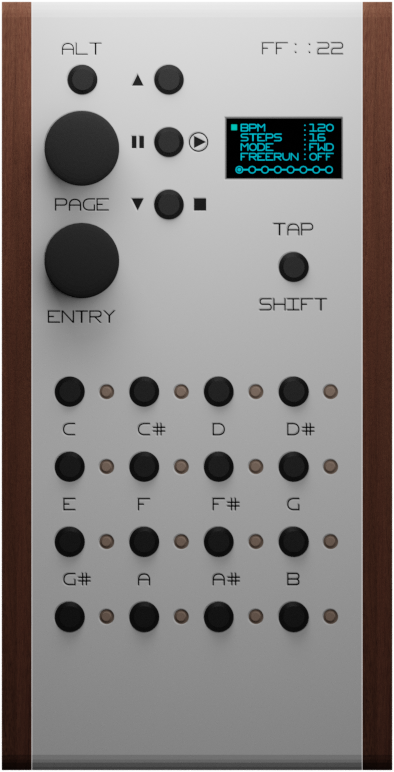

# RP2040 MIDI Sequencer
- 2-16 Steps
- 8 Tracks - each for dedicated midi-channel
- USB/DIN5 Output
- 4 modes (forward, backward, ping-pong, random)
- Adjustable velocity, time offset and duration for each note
- Langton's ant like cellular automata with user-defined rules
- Adjustable drift // TODO

